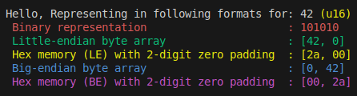

# 🎓 Rust Crate Experiment | byte-repr

[](https://crates.io/crates/byte-repr)
[](https://docs.rs/byte-repr)
[](https://github.com/himangshu-blockchain/byte-repr/actions)
[](https://github.com/himangshu-blockchain/byte-repr/blob/main/LICENSE)
[](https://crates.io/crates/byte-repr)
[](https://docs.rs/byte-repr)

> A lightweight utility for inspecting and learning about memory representation of integer types in Rust.

---

## 📘 Overview

`byte-repr` is a simple, extensible Rust crate to help visualize how numeric types are represented in memory. It supports both **little-endian** and **big-endian** byte formats, **binary representation**, and **hex with zero-padding**. 

Useful for:
- 🧠 Learning & teaching endianness and bit-level encoding
- 🛠️ Debugging binary data
- 🧬 Understanding low-level memory layouts in Rust

---

## ✨ Features

- 📦 Print values in:
  - Binary format (grouped bits)
  - Little-endian byte array
  - Big-endian byte array
  - Hexadecimal representation (zero-padded)
- 🧩 Macro-based extensibility for custom numeric types
- 🧪 Tested against all supported integer types
- 🎨 **Color-coded output for clarity**
---

## 🚀 Usage

Add this to your `Cargo.toml`:

```toml
[dependencies]
byte-repr = "0.1.0" # update after publishing
```

Then use in your code:

```rust
use byte_repr::represent;

fn main() {
    let x = 42u16;
    represent(&x);
}
```

### Example Output:



## 🔧 Supported Types

Currently supports:
- `i8`
- `u16`
- `u32`
- `u64`
- `u128`
- `usize`

✅ `impl_byterep!` macro makes it easy to extend support to custom numeric types.

## ⚠️ Limitations
- ❌ Not yet #![no_std] compatible

- ❌ No support for wasm32 (WebAssembly) targets

- 📌 Relies on println! for display, which isn't available in no_std or wasm

✅ These will be addressed in upcoming versions. Stay tuned!


## 🧪 Tests
Includes integration tests for:

- Endianness checks
- Binary and hex formatting
- Trait conformance per type
- Visual rendering test (smoke check)

## 📦 License

- Licensed under the [MIT License](LICENSE-MIT). 

See the [LICENSE-MIT](LICENSE-MIT) file for details.


## 📑 Changelog
See [CHANGELOG.md](./CHANGELOG.md) for a history of changes.

---

<p align="center">
  Made with ❤️ by <a href="https://himangshu-blockchain.github.io/">Himangshu Pan</a>
</p>
